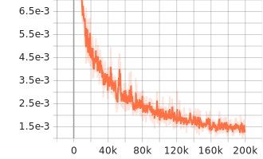

# NeRF-PyTorch 实验报告

## 一、实验目的

本实验旨在基于 NeRF-PyTorch 框架，完成如下目标：
- 理解并掌握 NeRF 的基本训练流程
- 增加 TensorBoard 支持，实现训练过程的可视化
- 掌握从头训练模型与实验复现的流程

## 二、主要修改内容

### 1. 增加 TensorBoard 支持
- 在 `run_nerf.py` 中引入了 `torch.utils.tensorboard.SummaryWriter`。
- 在训练过程中，定期记录 loss、PSNR、learning rate 等标量指标到 TensorBoard。
- 定期记录渲染结果、目标图像、视差图、累积不透明度图等到 TensorBoard，便于可视化训练效果。
- 解决了图像格式与数据类型的兼容性问题，保证所有图像均可被 TensorBoard 正确显示。

**代码片段示例：**
```python
from torch.utils.tensorboard import SummaryWriter
...
writer = SummaryWriter(os.path.join(basedir, 'summaries', expname))
...
writer.add_scalar('Loss/train', loss.item(), i)
writer.add_image('Train/RGB', to8b(rgb_np).transpose(2,0,1)/255.0, i, dataformats='CHW')
```

### 2. 支持从头训练
- 在配置文件 `configs/test.txt` 中添加 `no_reload = True`，确保训练时不会加载历史 checkpoint。
- 修改 `expname`，每次实验结果单独保存，避免与旧实验混淆。

**配置片段示例：**
```
expname = fern_test_fresh
no_reload = True
```

## 三、训练过程

1. 配置好 `configs/test.txt`，确保数据路径、实验名、训练参数等设置正确。
2. 运行训练命令：
   ```bash
   python run_nerf.py --config configs/test.txt
   ```
3. 训练过程中，loss、PSNR 等指标会定期输出到控制台，并同步写入 TensorBoard 日志。
4. 渲染结果、目标图像等会以图片形式写入 TensorBoard，便于直观对比。

## 四、可视化与结果分析

### 1. 启动 TensorBoard
```bash
tensorboard --logdir=logs/summaries
```

### 2. 训练损失与PSNR曲线

|Learning Rate| |
|---|---|
| | |
|Loss_train|Loss_train_coarse|
|| |
|PSNR_train|PSNR_train_coarse|
|||


### 3. 渲染效果对比
- 目标图像 vs. 渲染图像
- 视差图、累积不透明度图


## 五、视频渲染结果

| nerf_200000_disp | nerf_200000_rgb |
|------------------------------------|------------------------------------|
|  |  |

